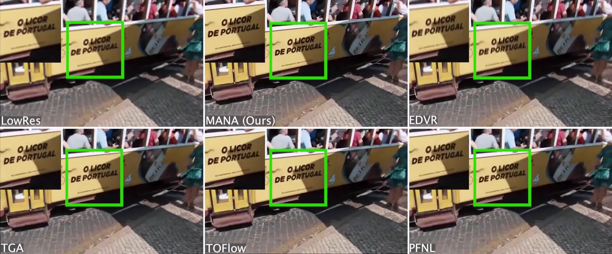

# Memory-Augmented Non-Local Attention (MANA) for Video Super-Resolution


## Introduction
This repository contains the official implementation of "Memory-Augmented Non-Local Attention for Video Super-Resolution" in CVPR 2022.<br>

Demo Video ([Watch in YouTube](https://www.youtube.com/watch?v=L8JKM9N_ig0)):<br>
[](https://www.youtube.com/watch?v=L8JKM9N_ig0)
<br>

## Updates
- 5/1/2022: uploaded data preparation code and training code. Test code will be uploaded soon.

## Dataset
The Parkour dataset and the videos shown in the supplementary material can be downloaded at:
<https://drive.google.com/drive/folders/1KJdYAtlVRN79jYp4jiLWjvU8hJ50dfT0?usp=sharing>

The folder contains 2 zip files:
- Parkour_Dataset.zip holds the 14 Parkour videos used in our main paper.
- Supplementary_Dataset.zip holds the 11 real-world videos shown in the Fig.1 of the supplementary material.

## Training

### Training Data Preparation

We use [Vimeo90K](http://toflow.csail.mit.edu/) dataset to train our network. In this repository, you can find a script named [prepare_data.py](https://github.com/jiy173/MANA/blob/main/prepare_data.py) which organizes Vimeo90K into an [hdf5](https://www.hdfgroup.org/solutions/hdf5/) file used in the training.

To do this, simply run:
```python
python prepare_data.py --dataset vimeo90k/ --output vimeo90k_dataset.h5
```
where "dataset" is the Vimeo90K dataset path containing both "sequences/" and "seq_trainlist.txt"; "output" sets the output hdf5 file path.

### Training MANA
The training configurations are summarized in [config.yaml](https://github.com/jiy173/MANA/blob/main/config.yaml) with detailed description of the meaning of each parameter. Please change it (e.g. dataset_path and checkpoint_folder) if needed.

To train the network, simply run:
```python
python train.py --config config.yaml
```
where "config" sets the training configuration file path.


## Reference
If you find our work useful, please cite our paper:
````
@InProceedings{MANA,
  author       = "Jiyang Yu and Jingen Liu and Liefeng Bo and Tao Mei",
  title        = "Memory-Augmented Non-Local Attention for Video Super-Resolution",
  booktitle    = "IEEE Conference on Computer Vision and Pattern Recognition (CVPR)",
  month        = "Jun",
  year         = "2022"
}
````
